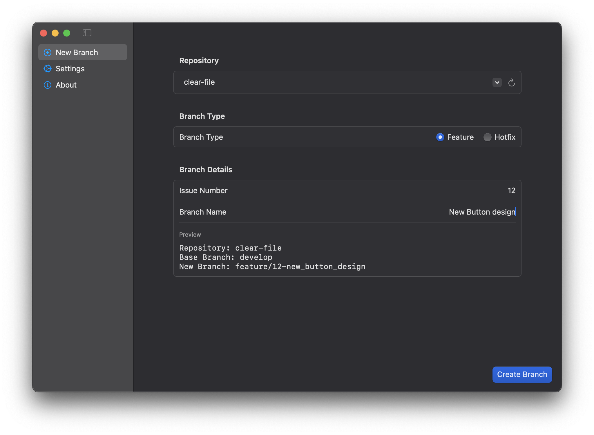
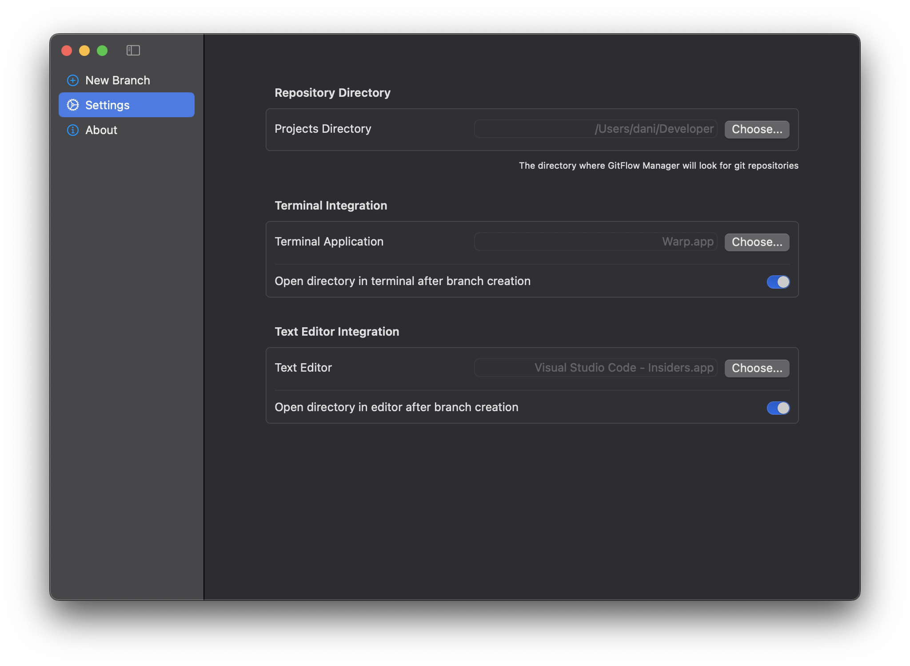

# GitFlow Manager

A Swift macOS application to automate the process of creating new branches using GitFlow.

Based on the better version of it I use from the Terminal. See [git-flow](https://github.com/SwiftlyDaniel/git-flow)

## Screenshots

| Main Screen | Settings Screen |
|-------------|-----------------|
|  |  |

## Features

- Automates the process of creating a new hotfix or feature branch
- Opens the new branch in the Terminal and/or Text Editor based on user preferences
- Adds the issue number to the branch name
- Dark/light mode support

## Requirements

macOS 14.6

## Installation

Double click the DMG file in the latest release and move the .app file into the Applications folder

## TODO

- Add functionality to close hotfixes/features
- Refactor code
- Improve UI/UX
- Handle errors gracefully
- Menu Bar (?)
- CI/CD (?)
- Dracula Theme (?)
- Whatever I can think of
- Get rid of GitFlow in favour of GitHub Flow

## Contributing

Pull requests and issues are welcome. For major changes, open an issue first to discuss your proposal.

## License

[Apache 2.0](./LICENSE.txt)
